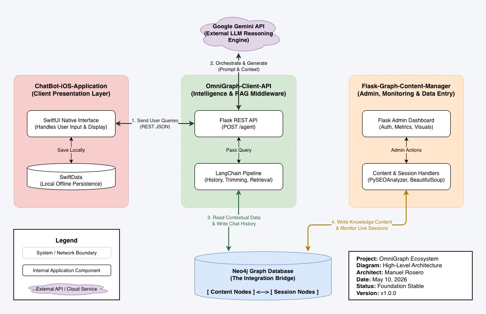
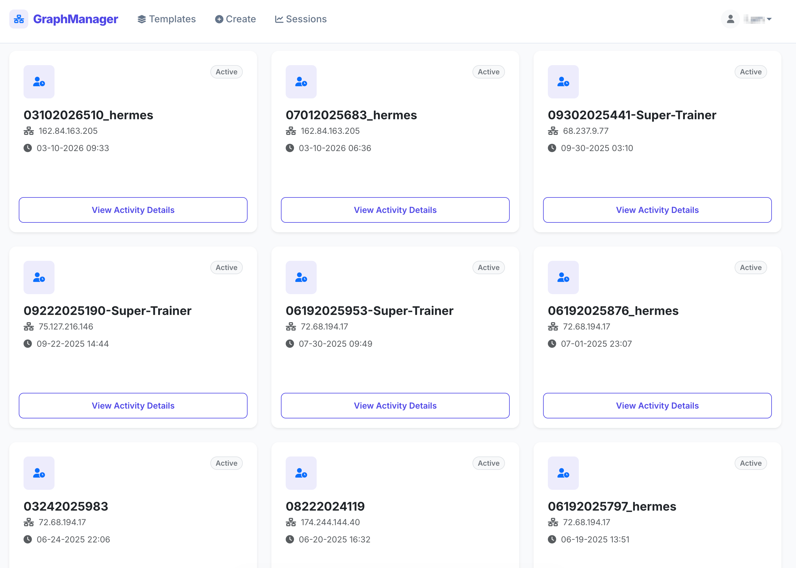
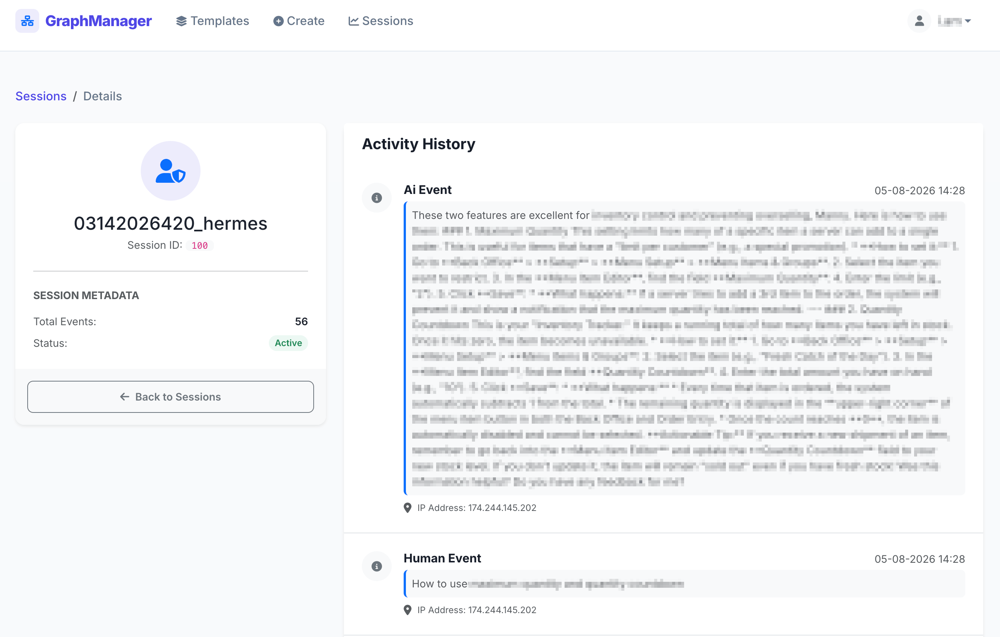

# Flask-Graph-Content-Manager


## Overview
**Flask-Graph-Content-Manager** is a modular, high-performance Content Management System (CMS) and AI session monitoring dashboard. Built on the Flask framework and powered by the Neo4j graph database, it provides a sophisticated interface for managing dynamic content, tracking user interactions, and analyzing SEO performance. It serves as the administrative backbone for the OmniGraph ecosystem.

## System Architecture
To understand how this manager interacts with the broader ecosystem (including the iOS client and the LangChain middleware), refer to the architecture below:


*Figure 1: High-level architecture of the OmniGraph Ecosystem.*

## The Ecosystem Context
This repository is a critical component of a unified AI and RAG (Retrieval-Augmented Generation) ecosystem. While the **OmniGraph-Client-API** handles the intelligence orchestration and the **ChatBot-iOS-Application** provides the user interface, the **Flask-Graph-Content-Manager** acts as the control plane. It allows administrators to:
- **Monitor real-time AI sessions** and visitor paths stored in Neo4j.
- **Manage the knowledge base** and blog content that fuels the RAG pipeline.
- **Oversee the health** and security of the entire graph-based network.

## Interface Preview
| Session Dashboard | Activity Detail View |
| :--- | :--- |
|  |  |
| *Admin view showing active AI sessions.* | *Deep dive into specific Human-AI interactions.* |

## Key Features
- **Graph-Based Data Modeling:** Leverages Neo4j for complex relationship mapping between content, users, and AI sessions.
- **AI Session Monitoring:** Dedicated module for tracking and visualizing interactions between visitors and the AI agent.
- **Robust Authentication:** Secure user management using Flask-Bcrypt and WTForms.
- **SEO & Content Tools:** Integrated SEO analyzer and readability metrics to ensure high-quality content generation.
- **Modular Blueprint Architecture:** Easily extensible structure with separate modules for Auth, Blog, Content, and Database.
- **Automated Sitemap Generation:** Dynamic sitemap creation for optimized search engine indexing.

## Tech Stack
- **Backend:** Flask, Python 3.x
- **Database:** Neo4j (Graph Database)
- **Authentication:** Flask-Bcrypt, Flask-WTF
- **Content Tools:** BeautifulSoup4, NLTK, PySEOAnalyzer
- **Templating:** Jinja2, HTML5, CSS3

## Getting Started

### Local Setup
1. **Clone the repository:**
   ```bash
   git clone https://github.com/snowblow07/Flask-Graph-Content-Manager.git
   cd Flask-Graph-Content-Manager
   ```

2. **Create a virtual environment:**
   ```bash
   python -m venv .venv
   source .venv/bin/activate  # On Windows: .venv\Scripts\activate
   ```

3. **Install dependencies:**
   ```bash
   pip install -r requirements.txt
   ```

4. **Environment Variables:**
   Create a `.env` file or export the following:
   ```bash
   SECRET_KEY=your_secret_key
   NEO4J_URI=bolt://localhost:7687
   NEO4J_USER=neo4j
   NEO4J_PASSWORD=your_password
   ```

5. **Run the application:**
   ```bash
   python app.py
   ```
   The app will be available at `http://localhost:5050`.

## Usage / API Reference
- **Admin Dashboard:** Access via `/database` to manage graph nodes.
- **Session Monitor:** Navigate to `/sessions_management` to view live AI interactions.
- **Blog Management:** Use the `/blog` endpoints to create and update content.

## License
This project is licensed under the MIT License - see the [LICENSE](LICENSE) file for details.
